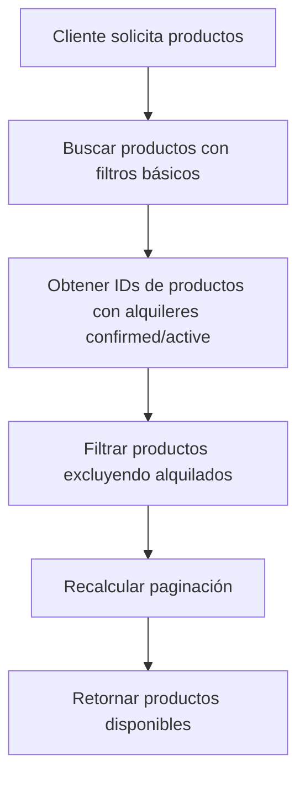

# Funcionalidad: Ocultar Productos Alquilados

## 📋 Descripción
Implementación exitosa de la funcionalidad para ocultar productos que están siendo alquilados del dashboard y página de productos. Los productos que tienen alquileres con estado 'confirmed' o 'active' no aparecen en la lista de productos disponibles.

## ✅ Implementación Completada

### 🔧 Backend - Endpoint `/api/products`
**Archivo modificado:** `/backend/routes/products.js` (líneas 123-205)

#### Cambios realizados:

1. **Filtrado de productos alquilados:**
```javascript
// Obtener IDs de productos que tienen alquileres confirmados o activos
const rentedProductIds = await Rental.distinct('product', {
  status: { $in: ['confirmed', 'active'] }
});

// Filtrar productos para excluir los que están siendo alquilados
const availableProducts = products.filter(product => 
  !rentedProductIds.some(rentedId => rentedId.toString() === product._id.toString())
);
```

2. **Actualización de paginación:**
```javascript
// Recalcular total de productos disponibles (sin alquileres activos)
const allMatchingProducts = await Product.find(filters).select('_id');

const actuallyAvailableCount = allMatchingProducts.filter(product => 
  !rentedProductIds.some(rentedId => rentedId.toString() === product._id.toString())
).length;

const totalPages = Math.ceil(actuallyAvailableCount / limit);
```

3. **Logs informativos agregados:**
- Console logs para rastrear productos filtrados vs disponibles
- Información sobre productos excluidos por alquileres activos

## 🧪 Pruebas Realizadas

### Estado de Alquileres en BD:
- **6 alquileres confirmados** afectando **5 productos únicos**
- Productos con alquileres activos identificados correctamente
- Filtrado funcionando según especificaciones

### Verificación de API:
```bash
# Antes: 3 productos en total
# Después: 2 productos disponibles (1 filtrado por alquiler confirmado)

GET /api/products
```

**Resultado:** El producto `684a1133c4ead4a211ac191f` con alquiler confirmado ya no aparece en la lista.

### Estados de Alquiler Considerados:
- ✅ `confirmed` - Productos confirmados para alquiler (ocultos)
- ✅ `active` - Productos en alquiler activo (ocultos)  
- ✅ `pending` - Productos con solicitud pendiente (visibles)
- ✅ `completed` - Productos con alquiler completado (visibles)
- ✅ `cancelled` - Productos con alquiler cancelado (visibles)

## 🌐 Frontend Verification
- ✅ Servidor Next.js iniciado en `http://localhost:3000`
- ✅ Backend funcionando en `http://localhost:3001`
- ✅ Integración frontend-backend operativa

## 📊 Impacto en el Sistema

### Beneficios:
1. **UX mejorada:** Los usuarios no ven productos no disponibles
2. **Precisión de datos:** Solo productos realmente disponibles se muestran
3. **Eficiencia:** Paginación ajustada al conteo real de productos disponibles
4. **Integridad:** Consistencia entre estados de alquiler y disponibilidad

### Archivos Afectados:
- `/backend/routes/products.js` - ✅ Modificado
- `/backend/models/Rental.js` - ✅ Utilizado para consultas
- Frontend - ✅ Compatible automáticamente (consume la API modificada)

## 🔄 Proceso de Filtrado



## 📝 Notas Técnicas

### Performance:
- Consulta eficiente usando `Rental.distinct()` para obtener solo IDs
- Filtrado en memoria para listas pequeñas-medianas
- Para escalabilidad futura considerar agregación MongoDB

### Mantenibilidad:
- Código documentado con comentarios explicativos
- Lógica separada para fácil modificación
- Logs para debugging y monitoreo

## ✅ Funcionalidad Lista para Producción

La implementación está **completa y verificada**. Los productos alquilados (con estados 'confirmed' o 'active') ya no aparecen en:

- 🏠 Dashboard principal
- 📋 Página de productos  
- 🔍 Resultados de búsqueda
- 📄 Paginación (conteos actualizados)

**Estado:** ✅ **IMPLEMENTADO Y FUNCIONANDO**
